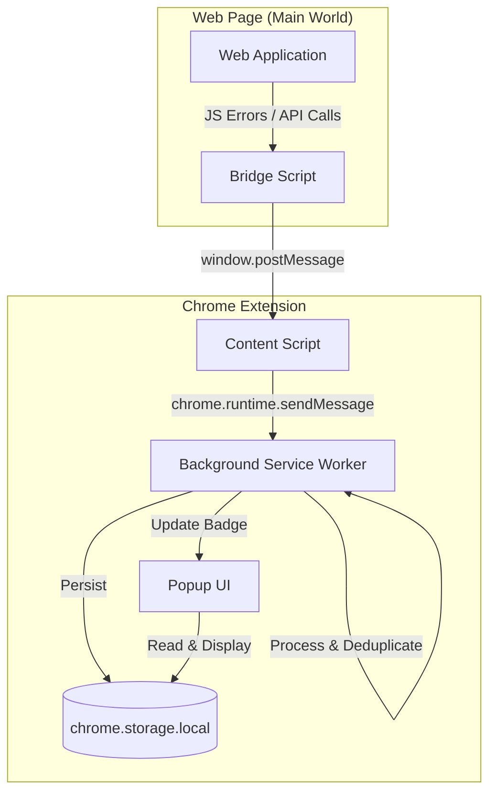
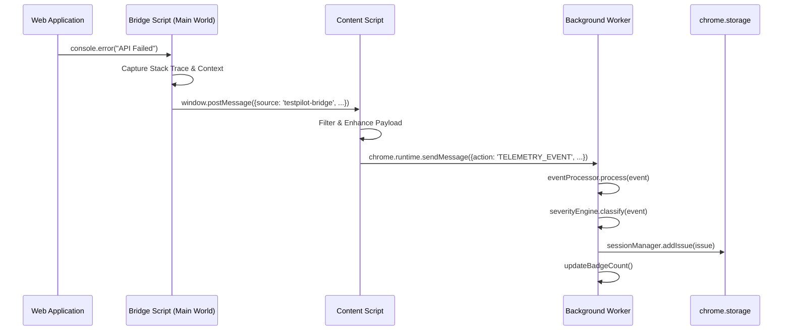
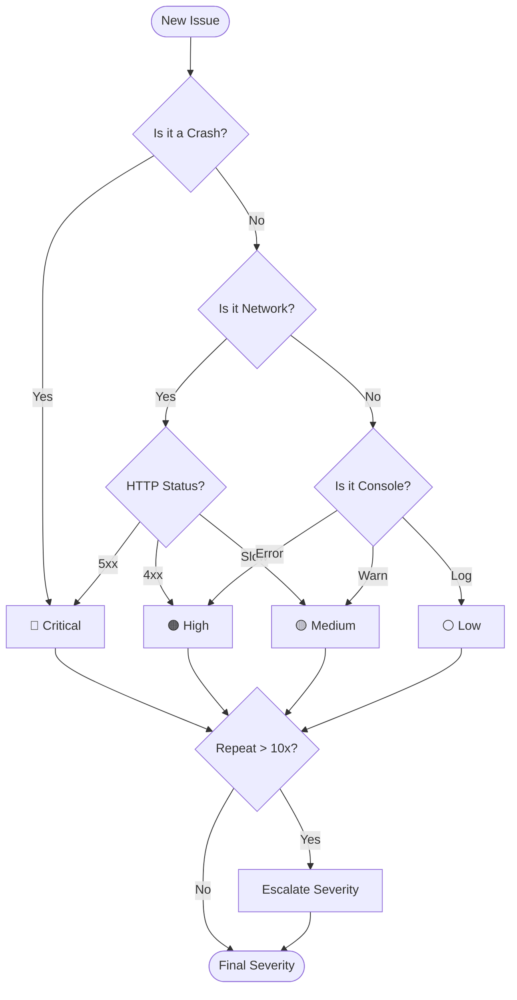

# 🧪 TestPilot

**Intelligent Bug Detection & Telemetry Chrome Extension for Modern Web Apps**

TestPilot is a production-grade Chrome extension that acts as a silent flight recorder for your web application. It captures bugs, network failures, security risks, and performance issues in real-time — before your users report them.

---

## ✨ Features

### 🖥️ Console Monitoring
- Intercepts `console.error` and `console.warn` calls from deep inside the page (via a **Main World bridge script** that runs before any other JS)
- Captures the **caller file, line, and column** from the stack trace automatically
- Passes every console message through the **Security Scanner** before logging

### 🌐 Network Intelligence
- Wraps both **`window.fetch`** and **`XMLHttpRequest`** to intercept all outgoing requests
- Captures **HTTP 4xx / 5xx** failures as `network_failure` issues
- Detects **Slow APIs** — requests exceeding the configurable threshold (default: 1000ms)
- Detects **API Retry Storms** — automatically escalates to `retry_storm` (Critical) when the same endpoint fails 3+ times within 5 seconds
- Records **request payload**, **response status**, and **response body** (up to 2000 chars) for every failing or slow request

### ⚡ Runtime Crash Detection
- Listens for `window.onerror` to catch **unhandled JavaScript exceptions** with full file/line/column/stack metadata
- Listens for `window.onunhandledrejection` to catch **unhandled Promise rejections**

### 📦 Broken Resource Detection
- Listens on the capture phase for failed loads of ``, `<script>`, and `<link>` tags
- Records the tag type, source URL, and outer HTML of the broken element

### 🛡️ Security Scanner
Automatically scans console output and `localStorage` writes for sensitive data leaks:
| Pattern | Detected As |
|---|---|
| JWT tokens (`eyJ...`) | `JWT Token` |
| Email addresses | `Email Address` |
| Phone numbers | `Phone Number` |
| API keys / secrets | `API Key/Secret` |
| Sensitive keys written to `localStorage` (`token`, `password`, `api_key`, `jwt`, `auth`) | `storage_leak` |

### 🧠 Severity Engine
All issues are automatically classified into four severity levels:

| Level | Issue Types |
|---|---|
| 🔴 **Critical** | Runtime crashes, white screens, retry storms, CORS failures, security risks, HTTP 5xx |
| 🟠 **High** | Console errors, resource failures, HTTP 4xx network failures |
| 🟡 **Medium** | Slow APIs, console warnings |
| ⚪ **Low** | Console logs |

**Adaptive Escalation:** If the same issue repeats beyond a configurable threshold (default: 10×), its severity automatically upgrades one level (e.g. Medium → High → Critical).

### 🗂️ Issue Deduplication
Issues are fingerprinted by type + message hash. Repeated occurrences of the same bug increment an `occurrences` counter and update `lastSeen` instead of creating duplicates — keeping reports clean and actionable.

### 📊 Session Management
- Every recording is isolated as a **Session** with a unique UUID
- Sessions store full metadata: `userAgent`, `viewport`, `URL`, `platform`
- Sessions persist across page navigations via `chrome.storage.local`
- Session history is browsable from the popup

### 📤 Report Export
Completed sessions can be exported in two formats:

- **JSON** — Raw structured data, ideal for programmatic processing or filing in issue trackers
- **Markdown** — Human-readable report with:
  - Executive summary with issue counts per severity
  - ⚠️ Critical issue call-out banner
  - **Release Blockers** section (Critical issues only)
  - **High Priority** section
  - **Medium Priority** section
  - Full **Timeline** of all issues sorted by time of occurrence

### 🎨 UI
- Modern, white-and-blue minimal popup (400px wide)
- Live issue list with **severity filter buttons** (All / Critical / High / Medium / Low)
- Issue cards showing type, message, occurrence count, and URL
- Expandable **request/response body detail** for network issues
- Session history view with per-session issue count pills
- Extension badge shows the live total issue count during recording

---

## ⚙️ Configuration

Click the **⚙** icon in the popup to open the Settings panel:

| Setting | Default | Description |
|---|---|---|
| **Slow API Threshold** | `1000` ms | Requests taking longer than this are flagged as Slow API (Medium) |
| **Escalation Threshold** | `10` × | Issues repeating this many times auto-escalate one severity level |
| **Monitor Types** | All enabled | Toggle individual monitors on/off (runtime crash, console error, network failure, slow API, retry storm, resource failure, CORS, security risk, white screen) |

---

## 🛠️ Installation (Developer Mode)

```bash
# 1. Clone the repo
git clone https://github.com/your-username/TestPilot.git
cd TestPilot

# 2. Install dependencies
npm install

# 3. Build for production
npm run build
```

Then in Chrome:
1. Go to `chrome://extensions`
2. Enable **Developer mode** (top-right toggle)
3. Click **Load unpacked**
4. Select the `dist/` folder

---

## 💻 Development

```bash
# Type-check only (no emit)
npm run type-check

# Start Vite dev server (for popup UI iteration)
npm run dev

# Build for production
npm run build
```

---

## 🏗️ Architecture

TestPilot uses a multi-layered architecture to ensure it can capture telemetry that standard content scripts cannot reach.

### 🧩 System Components



### 🔄 Event Life Cycle

The following sequence diagram tracks a single `console.error` from the application through to the extension storage.



### 🧠 Severity & Escalation Logic

Issues are automatically classified and can be promoted to higher severities if they become "noisy" (repeat frequently).



**Key design decisions:**
- The **bridge script** (`bridge.ts`) is injected into the **Main World** (not isolated content script context) so it can intercept the page's own `fetch`, `XMLHttpRequest`, and `console` before any frameworks or libraries wrap them.
- The **background service worker** is the single source of truth for session state, keeping the popup and content scripts stateless and easily restartable.
- **Fingerprinting** is done at issue creation time, making deduplication a simple array lookup.

---

## 📦 Tech Stack

| Layer | Technology |
|---|---|
| UI | [Preact](https://preactjs.com/) + TypeScript |
| Build | [Vite](https://vitejs.dev/) v7 |
| Styles | Vanilla CSS |
| Storage | `chrome.storage.local` |
| Types | `@types/chrome` |

---

## 🤝 Contributing

1. Fork the repository
2. Create your feature branch (`git checkout -b feature/amazing-feature`)
3. Commit your changes (`git commit -m 'feat: add amazing feature'`)
4. Push to the branch (`git push origin feature/amazing-feature`)
5. Open a Pull Request

---

## 📄 License

MIT License — free to use for personal and commercial projects.
